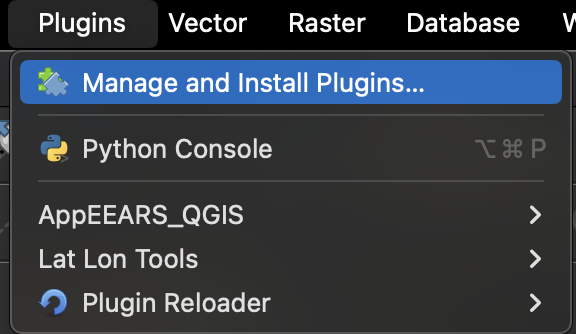
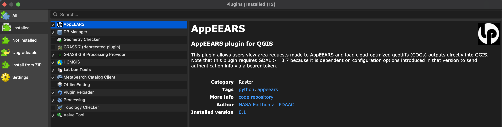
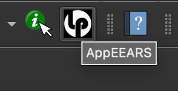
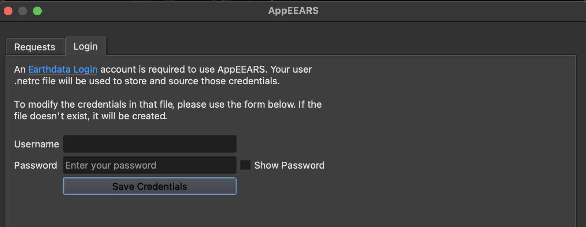
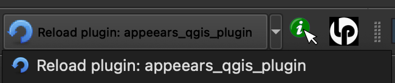
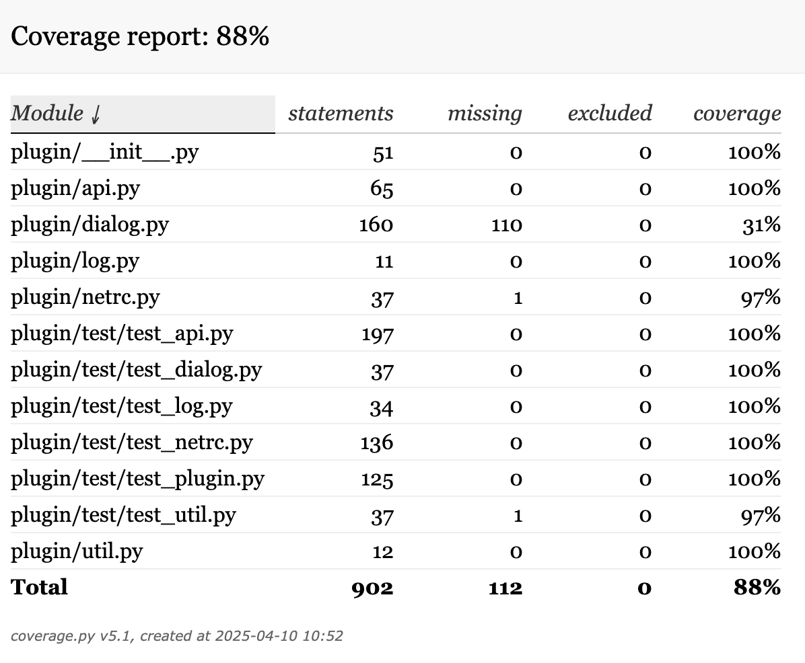

# Development

This document details aspects of development for maintainers of the project.

## Project Structure

- `AppEEARS` - The actual installable QGIS plugin; this whole folder is what gets copied/symlinked into a QGIS plugins directory or packaged into a release zip.
  - `__init__.py` - Entry point that QGIS uses for the plugin.
  - `metadata.txt` - Plugin metadata read by QGIS's plugin manager.
  - `plugin` - Contains the source for the app; it is a Python package.
    - `test` - Contains all unit tests.
  - `assets` - Contains all assets used by the app, including it's icon file.
  - `i18n` - Used for any translations.
- `run_unit_tests.sh` - Shell script for executing the unit tests.
- `doc` - Contains support documentation
- `.devcontainer` - Files for supporting development via Docker containers with the VSCode IDE.
- `README.md` - General project information.
- `LICENSE` - License for the project.
- `CITATION.cff` - [Human and machine readable](https://citation-file-format.github.io/) citation information.

Everything outside `AppEEARS/` is project/development tooling, not part of the plugin itself.

More on QGIS Python plugin structure can be found on [this page](https://docs.qgis.org/3.44/en/docs/pyqgis_developer_cookbook/plugins/plugins.html).

## Installation

The `AppEEARS` folder itself (not the repo root) must be present in the plugins directory of your QGIS install. QGIS looks for `metadata.txt` directly inside the plugin directory it's given.

On MacOS, it should be under your user directory at `~/Library/Application Support/QGIS/QGIS3/profiles/default/python/plugins`.

If your project code is stored in a different directory, you can create a symlink there, pointing at the `AppEEARS` subfolder of your clone. For example:

```bash
$ ~/Library/Application Support/QGIS/QGIS3/profiles/default/python/plugins
$ ls -laht
...
AppEEARS -> /Users/<username>/dev/appeears_qgis_plugin/AppEEARS/
...
```

## Developing

Use the IDE of your choice to modify the app code, the Python `plugin` package.

If using VSCode, it maybe be advantageous to [develop within a Docker container](https://code.visualstudio.com/docs/devcontainers/containers).

The `.devcontainer` dir at the project root contains an example config file, `Dockerfile` and Python `requirements` file that can be used for your local development environment.

## Using the Plugin

Open the QGIS app, and in the menu, go to `Plugins > Manage and Install Plugins...`:



You should be able to see the plugin, which is named "AppEEARS":



Then click "Install Plugin".  You should then see the plugin in one of the toolbars:



Click on the icon, and the plugin will open:



The [Plugin Reloader](https://plugins.qgis.org/plugins/plugin_reloader/) plugin is very helpful when you are developing.  It can reload the plugin on the fly, without having to uninstall and reinstall the AppEEARS plugin again.

Simply install it through the manage plugins menu, and you'll see it in the plugin area of the toolbar.  Select the plugin and click it to reload it:



## Unit Testing

In order to execute the unit tests, the Python interpreter used by the QGIS install must be used.

On MacOS, the path to the binary might be:

`/Applications/QGIS.app/Contents/MacOS/bin/python3.9`

On Windows, you need the QGIS-provided wrapper script rather than the raw interpreter. Calling
`bin\python.exe` directly will fail to even start (it can't locate its own standard library
without the environment variables the wrapper sets up). The wrapper lives alongside it:

`C:\Program Files\QGIS <version>\bin\python-qgis-ltr.bat` (or `python-qgis.bat` for a non-LTR release)

The QGIS-bundled Python environment doesn't include `pytest`/`coverage` by default, so install them
into it once:

```bash
$ "C:\Program Files\QGIS <version>\bin\python-qgis-ltr.bat" -m pip install pytest coverage
```

The Unix shell script `run_unit_tests.sh`, at the project root, can be used to execute the unit tests, including coverage.  It supports one argument, which is the absolute path to the Python interpreter. Quote it if the path contains spaces (the default Windows install path always does):

```bash
$ ./run_unit_tests /path/to/QGIS/python
```

If that arg is not given, it will default to the MacOS value listed above.

```bash
$ ./run_unit_tests.sh
using QGIS Python at /Applications/QGIS.app/Contents/MacOS/bin/python3.9
================================================================================ test session starts ================================================================================
platform darwin -- Python 3.9.5, pytest-6.0.1, py-1.9.0, pluggy-0.13.1 -- /Applications/QGIS.app/Contents/MacOS/bin/python3.9
...
plugin/test/test_api.py::ClientTest::test_build_file_url PASSED                                                                                                               [  2%]
plugin/test/test_api.py::ClientTest::test_fetch_bundle_data PASSED                                                                                                            [  5%]
plugin/test/test_api.py::ClientTest::test_fetch_bundle_data_login_error PASSED                                                                                                [  7%]
...
================================================================================ 38 passed in 8.48s =================================================================================
Name                         Stmts   Miss  Cover   Missing
----------------------------------------------------------
plugin/__init__.py              51      0   100%
plugin/api.py                   65      0   100%
plugin/dialog.py               160    136    15%   19-66, 69-71, 74, 80, 88-119, 133, 150, 160-197, 204-222, 229-270, 277-298, 307-348
plugin/log.py                   11      0   100%
plugin/netrc.py                 37      1    97%   83
plugin/test/test_api.py        197      0   100%
plugin/test/test_log.py         34      0   100%
plugin/test/test_netrc.py      136      0   100%
plugin/test/test_plugin.py     125      0   100%
plugin/test/test_util.py        37      1    97%   11
plugin/util.py                  12      0   100%
----------------------------------------------------------
TOTAL                          865    138    84%
```

Coverage HTML files are written, and can be viewed in a browser at:

`file://{abspath_to_project_root}/AppEEARS/cover/index.html`

e.g.
`file:///Users/<username>/dev/appeears_qgis_plugin/AppEEARS/cover/index.html`



You can also manually set an env var that represents the absolute path to the Python binary, then leverage it with `pytest` as necessary. Run this from inside the `AppEEARS` folder, since that's where `plugin/` actually lives:

```bash
$ cd AppEEARS
$ tgt_python=/Applications/QGIS.app/Contents/MacOS/bin/python3.9
$ $tgt_python -m coverage run -m pytest -v plugin/test/test_plugin.py --tb=long --disable-pytest-warnings
```

## Releasing

Until packaging/publishing is automated, building the release zip is a manual step. From the repo root, after tagging the release commit:

```bash
TREE=$(git rev-parse HEAD^{tree})
NEWTREE=$( { git ls-tree "$TREE:AppEEARS"; \
  printf '100644 blob %s\tLICENSE\n' "$(git rev-parse HEAD:LICENSE)"; \
  printf '100644 blob %s\tREADME.md\n' "$(git rev-parse HEAD:README.md)"; \
} | git mktree )
git archive --format=zip --prefix=AppEEARS/ "$NEWTREE" > AppEEARS.zip
```

This packages everything under `AppEEARS/` (tests excluded automatically via `AppEEARS/.gitattributes`) and merges in the repo root's `LICENSE` and `README.md` at the top of the plugin folder, which QGIS's plugin repository requires. It's implemented with `git` plumbing rather than `--prefix` plus a flat file list (an earlier version of this command double-nested `AppEEARS/AppEEARS/...`, since the source paths already started with `AppEEARS/`) or a filesystem copy step, so it doesn't depend on external tools like `zip`/`tar` being installed, and never touches your working tree.

Attach the resulting `AppEEARS.zip` to the GitHub Release for that tag; this is the file linked from the user guide's install instructions. Before publishing, sanity-check it by installing it into a fresh QGIS profile via `Install from ZIP` (see the user guide's verification steps) to confirm nothing needed at runtime was left out of the archive.