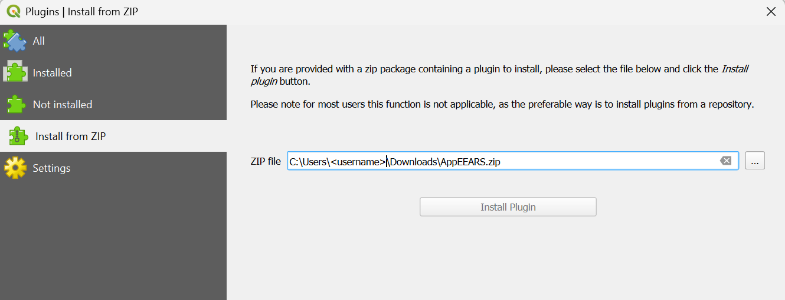
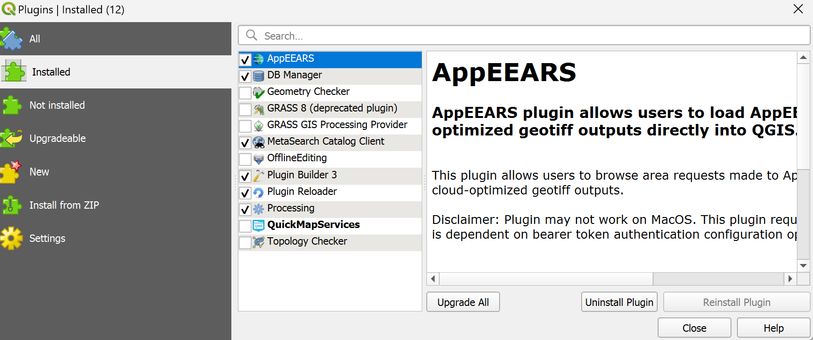
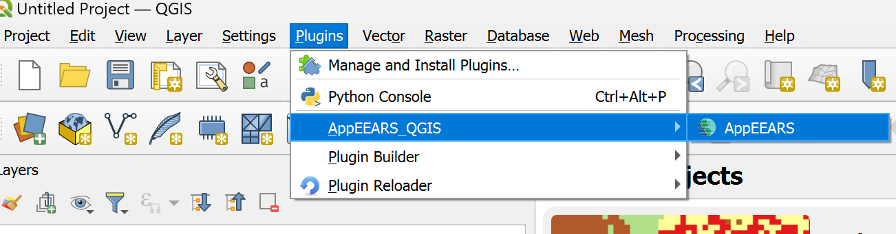
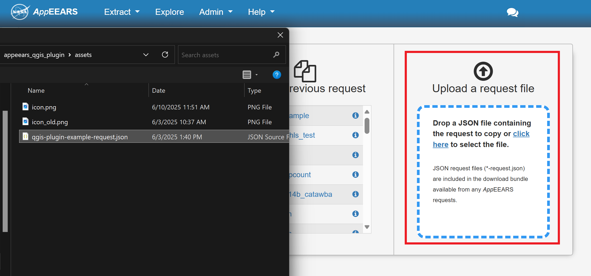
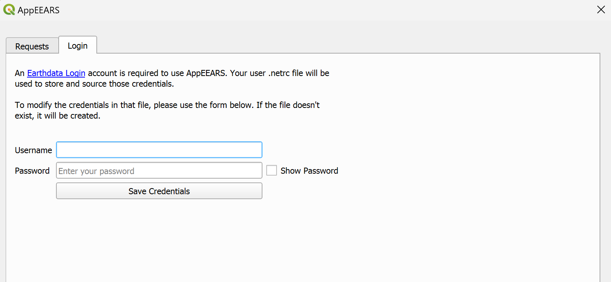
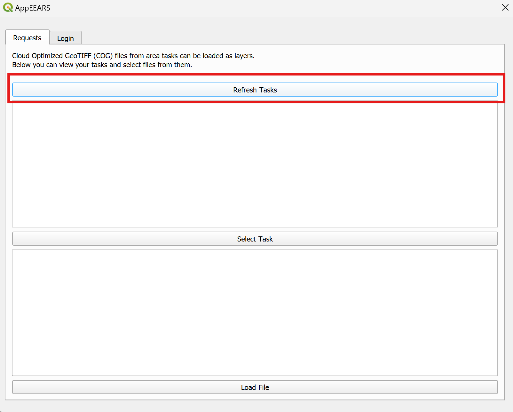
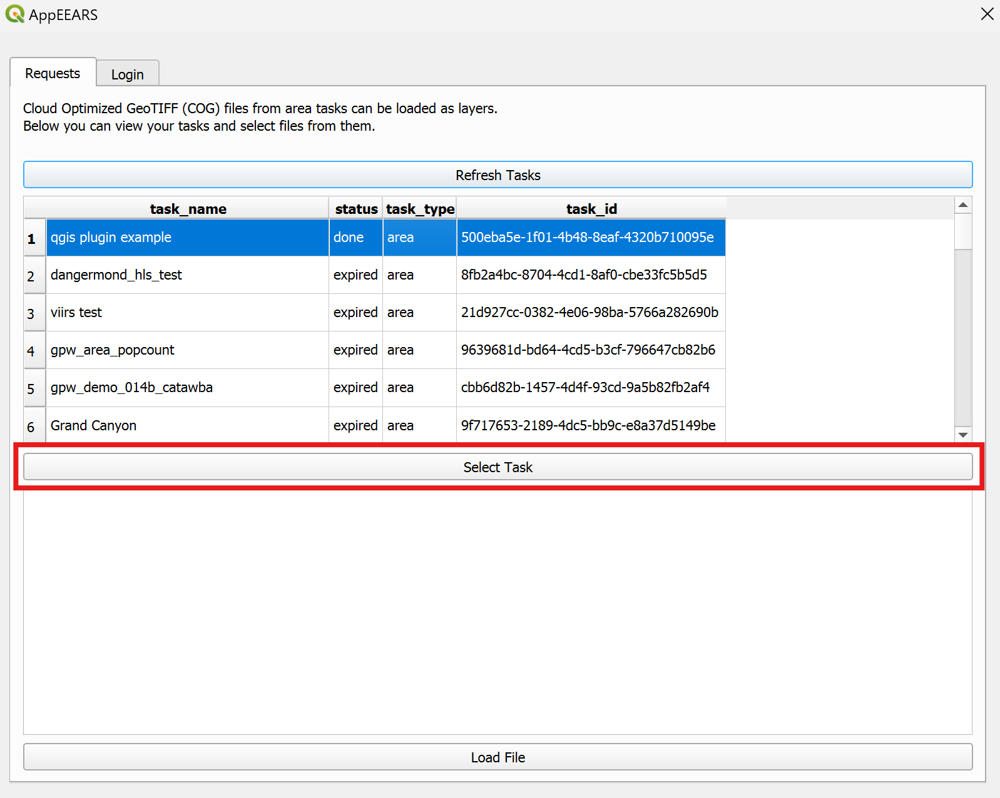
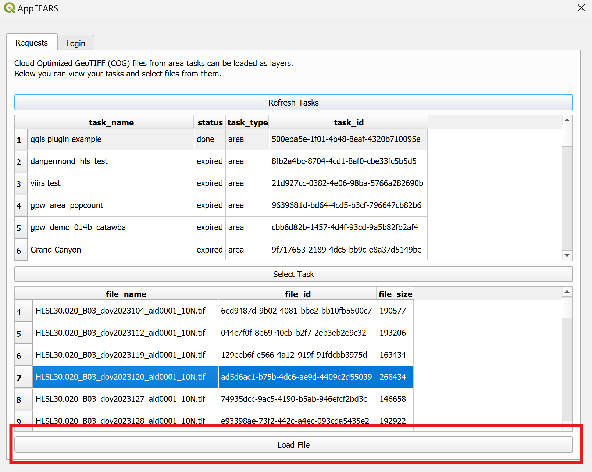
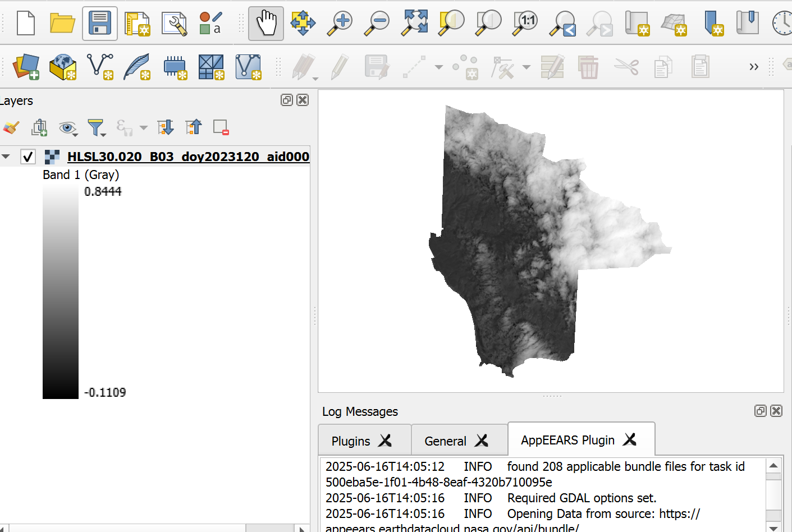

# AppEEARS QGIS Plugin User Guide

The [AppEEARS QGIS Plugin](https://github.com/nasa/AppEEARS-QGIS-Plugin) allows users to browse previously submitted requests from NASA's [Application for Extracting and Exploring Analysis Ready Samples (AppEEARS)](https://appeears.earthdatacloud.nasa.gov/) and load the output files directly into QGIS. This plugin currently only supports opening area sample requests with [cloud-optimized geotiff](https://cogeo.org/) formatted outputs.

This document details how to install and get started using the [AppEEARS QGIS Plugin](https://github.com/nasa/AppEEARS-QGIS-Plugin).

## Installing the Plugin

Until the plugin is available from the official [QGIS Plugin List](https://plugins.qgis.org/plugins/), you can install it using QGIS's built-in "Install from ZIP" feature. Follow these steps:

1. Download the `AppEEARS.zip` asset from the latest [release](https://github.com/nasa/AppEEARS-QGIS-Plugin/releases).

2. In QGIS, go to `Plugins` > `Manage and Install Plugins...` > `Install from ZIP`, browse to the `AppEEARS.zip` you just downloaded, and click `Install Plugin`.

3. Confirm it's enabled under `Plugins` > `Manage and Install Plugins...` > `Installed`; the box beside AppEEARS should be checked.

4. Launch by going to `Plugins` > `AppEEARS QGIS`

If you're actively developing the plugin rather than just using it, see the [development guide](development.md) instead. It covers symlinking the `AppEEARS` folder directly into your QGIS profile, so your edits are the live source instead of a zip you'd need to rebuild and reinstall; using the [Plugin Reloader](https://plugins.qgis.org/plugins/plugin_reloader/) tool from there lets QGIS pick up those edits with a single click instead of a restart.

## Using the Plugin

1. Submit an area sample request to [AppEEARS](https://appeears.earthdatacloud.nasa.gov/) with cloud-optimized geotiff format selected for the outputs. We've included an example area request, `qgis-plugin-example-request.json`, in the plugin's `assets` directory (`AppEEARS/assets` inside your QGIS plugins folder) that can be uploaded and submitted on the [Extract Area Sample Page](https://appeears.earthdatacloud.nasa.gov/task/area). See the [AppEEARS documentation](https://appeears.earthdatacloud.nasa.gov/help) for more information on how to do this.

2. Enter [Earthdata Login Account](https://urs.earthdata.nasa.gov/home) credentials in the login tab the first time the plugin is used. This will save them in a .netrc file in the user's home directory. If you already have your Earthdata Login credentials present in a .netrc file, this step is not necessary.

3. Browse previously submitted AppEEARS requests in the `Requests` tab by pressing the refresh button at the top. This will populate a table showing the task name, status, task type, and task id.

4. Click on a row in the table to select it, and press the `Select` button to open the task bundle. This will show a table with all of the output files associated with the selected request. The table includes file name, file id and file size.

5. Click on a row containing a file name ending in .tif to select it, then press the `Load Data` button to add the file as a layer in QGIS.

6. Now you should see the loaded geotiff. This might take a while if your connection is slow.

## Development

Aspects relevant to maintainers for development purposes can be found in [this document](development.md).

## Contact Info

Email: LPDAAC@usgs.gov  
Voice: +1-866-573-3222  
Organization: Land Processes Distributed Active Archive Center (LP DAAC)¹  
Website: https://www.earthdata.nasa.gov/centers/lp-daac  

¹Work performed under USGS contract G15PD00467 for NASA contract NNG14HH33I.